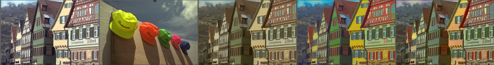

# Color Transfer in Python

A python implementation of [*Automated colour grading using colour distribution transfer*](http://citeseerx.ist.psu.edu/viewdoc/download?doi=10.1.1.458.7694&rep=rep1&type=pdf) by F. Pitie , A. Kokaram and R. Dahyot.

# Examples




# Run
```bash
python color_transfer.py
```
check results in imgs folder.

# References
[Author's matlab implementation](https://github.com/frcs/colour-transfer)
