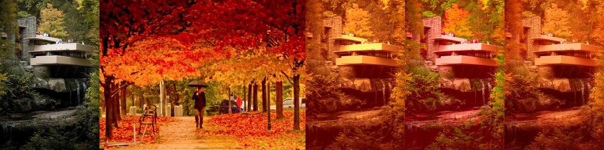

# Color Transfer in Python

Three methods of color transfer implemented in python.

# Examples
input img | reference img | mean std transfer | lab mean std transfer | pdf transfer + regrain




# Run
```bash
# python color_transfer.py && sz imgs/*display*
/root/python_color_transfer/imgs/scotland_house.png: 361x481x3
/root/python_color_transfer/imgs/scotland_plain.png: 361x481x3
pdf transfer time: 0.65s
regrain time: 0.47s
mean std transfer time: 0.04s
lab mean std transfer time: 0.23s
save to /root/python_color_transfer/imgs/scotland_display.png
/root/python_color_transfer/imgs/house.jpeg: 512x768x3
/root/python_color_transfer/imgs/hats.png: 512x768x3
pdf transfer time: 1.42s
regrain time: 1.10s
mean std transfer time: 0.08s
lab mean std transfer time: 0.09s
save to /root/python_color_transfer/imgs/house_display.png
/root/python_color_transfer/imgs/fallingwater.png: 727x483x3
/root/python_color_transfer/imgs/autumn.jpg: 727x1000x3
pdf transfer time: 1.81s
regrain time: 0.85s
mean std transfer time: 0.11s
lab mean std transfer time: 0.11s
save to /root/python_color_transfer/imgs/fallingwater_display.png
```

# Methods

Let input image be I, reference image be R and output image be O.

Let f{I}(r, g, b), f{R}(r, g, b) be probability density functions of I and R's rgb values. 

- mean std transfer

O = (I - mean(I)) / std(I) \* std(R) + mean(R).

- lab mean transfer

lI = rgb2lab(I),\
lR = rgb2lab(R),\
lO = (lI - mean(lI)) / std(lI) \* std(lR) + mean(lR),\
O = lab2rgb(lO).

- pdf transfer

O = t(I), where t: R^3-> R^3 is a continous mapping so that f{t(I)}(r, g, b) = f{R}(r, g, b). 


# References
- pdf transfer

[*Automated colour grading using colour distribution transfer*](http://citeseerx.ist.psu.edu/viewdoc/download?doi=10.1.1.458.7694&rep=rep1&type=pdf) by F. Pitie , A. Kokaram and R. Dahyot.\
[Author's matlab implementation](https://github.com/frcs/colour-transfer)

- lab mean transfer

[*Color Transfer between Images*](https://www.cs.tau.ac.il/~turkel/imagepapers/ColorTransfer.pdf) by Erik Reinhard, Michael Ashikhmin, Bruce Gooch and Peter Shirley.\
[Open source's python implementation](https://github.com/chia56028/Color-Transfer-between-Images)

