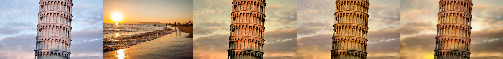
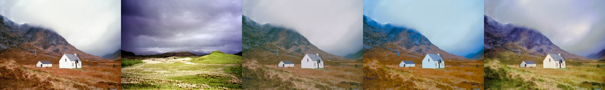

# Color Transfer in Python

Three methods of color transfer implemented in python.

## Examples
input img | reference img | mean std transfer | lab mean std transfer | pdf transfer + regrain





## Pip Wheels

### install
```bash
pip install python-color-transfer
```

### usage
```bash
from python_color_transfer.color_transfer import ColorTransfer

PT = ColorTransfer()

# input image and reference image
img_arr_in = cv2.imread(img_path)
img_arr_ref = cv2.imread(ref_path)

# pdf transfer
img_arr_reg = PT.pdf_tranfer(img_arr_in=img_arr_in,
                             img_arr_ref=img_arr_ref,
                             regrain=True)

# mean transfer
img_arr_mt = PT.mean_std_transfer(img_arr_in=img_arr_in,
                                  img_arr_ref=img_arr_ref)

# lab transfer
img_arr_lt = PT.lab_transfer(img_arr_in=img_arr_in,
                             img_arr_ref=img_arr_ref)
```

## From source

### Clone
```bash
git clone https://github.com/pengbo-learn/python-color-transfer.git
```

### Environment
- python3
- install dependency by ```sh env.sh```.
```bash
# env.sh
pip3 install opencv-python==4.2.0.34
pip3 install numpy==1.19.3
```
    

### Run
```bash
# python demo.py 
/root/python_color_transfer/imgs/scotland_house.png: 361x481x3
/root/python_color_transfer/imgs/scotland_plain.png: 361x481x3
pdf transfer time: 0.67s
regrain time: 0.49s
mean std transfer time: 0.04s
lab mean std transfer time: 0.22s
save to /root/python_color_transfer/imgs/scotland_display.png

/root/python_color_transfer/imgs/house.jpeg: 512x768x3
/root/python_color_transfer/imgs/hats.png: 512x768x3
pdf transfer time: 1.47s
regrain time: 1.16s
mean std transfer time: 0.09s
lab mean std transfer time: 0.09s
save to /root/python_color_transfer/imgs/house_display.png

/root/python_color_transfer/imgs/fallingwater.png: 727x483x3
/root/python_color_transfer/imgs/autumn.jpg: 727x1000x3
pdf transfer time: 1.87s
regrain time: 0.87s
mean std transfer time: 0.12s
lab mean std transfer time: 0.11s
save to /root/python_color_transfer/imgs/fallingwater_display.png

/root/python_color_transfer/imgs/tower.jpeg: 743x1280x3
/root/python_color_transfer/imgs/sunset.jpg: 743x1114x3
pdf transfer time: 2.95s
regrain time: 2.83s
mean std transfer time: 0.23s
lab mean std transfer time: 0.21s
save to /root/python_color_transfer/imgs/tower_display.png
```

## Methods

Let input image be I, reference image be R and output image be O.\
Let f{I}(r, g, b), f{R}(r, g, b) be probability density functions of I and R's rgb values. 

- mean std transfer

    O = (I - mean(I)) / std(I) \* std(R) + mean(R).

- lab mean transfer

    I' = rgb2lab(I),\
    R' = rgb2lab(R),\
    O' = (I' - mean(I')) / std(I') \* std(R') + mean(R'),\
    O = lab2rgb(O').

- pdf transfer

    O = t(I), where t: R^3-> R^3 is a continous mapping so that f{t(I)}(r, g, b) = f{R}(r, g, b). 


## References
- pdf transfer\
    [Automated colour grading using colour distribution transfer](http://citeseerx.ist.psu.edu/viewdoc/download?doi=10.1.1.458.7694&rep=rep1&type=pdf) by F. Pitie , A. Kokaram and R. Dahyot.\
    [Author's matlab implementation](https://github.com/frcs/colour-transfer)

- lab mean transfer\
    [Color Transfer between Images](https://www.cs.tau.ac.il/~turkel/imagepapers/ColorTransfer.pdf) by Erik Reinhard, Michael Ashikhmin, Bruce Gooch and Peter Shirley.\
    [Open source's python implementation](https://github.com/chia56028/Color-Transfer-between-Images)

